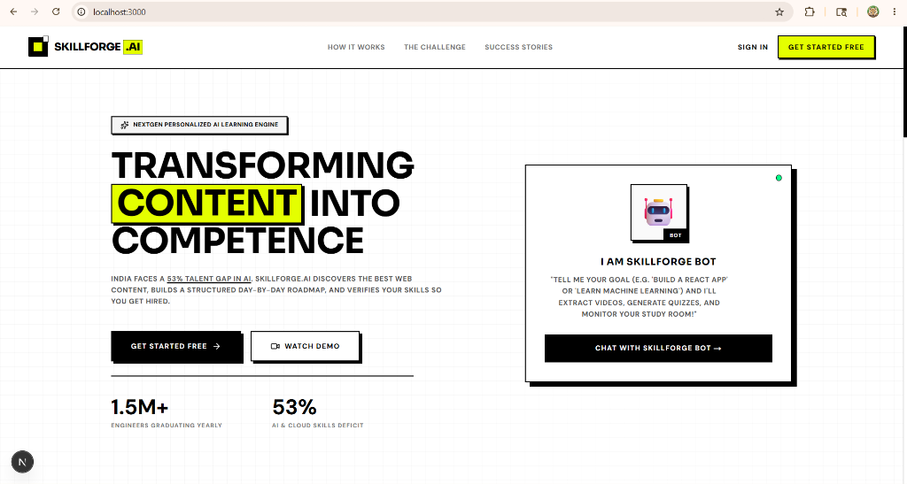
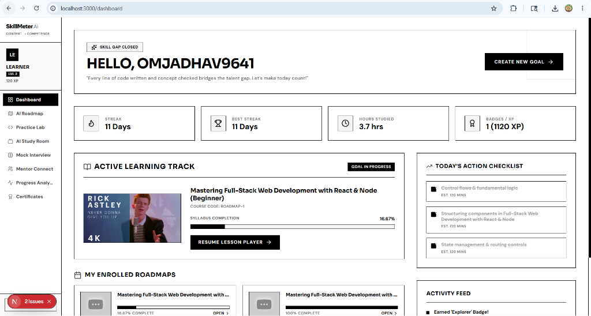
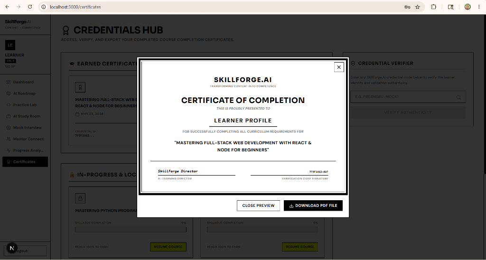
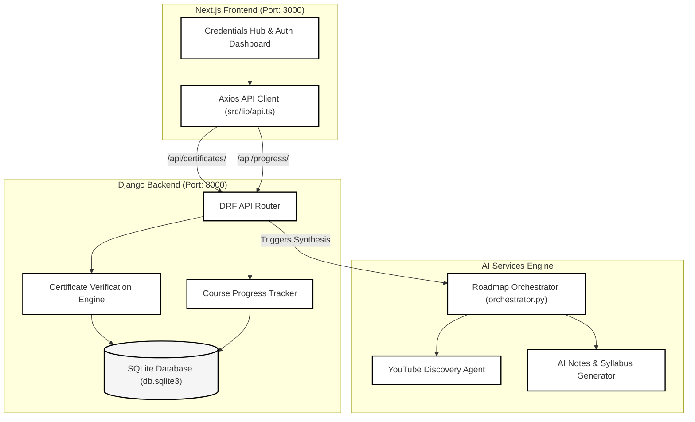

# ⚡ SkillForge.ai — Dynamic AI Learning Roadmaps & Secure Credentials

<p align="center">
  
  
  
  
  
  
</p>

---

## 🎨 Overview
**SkillForge.ai** is a premium, high-fidelity AI-powered learning platform designed for structured roadmap generation, dynamic progress tracking, and **security-hardened course certifications**. 

Featuring a striking, custom **Swiss Neobrutalist design system**—with sharp contrast lines, thick offsets, interactive micro-animations, and vibrant color-blocks—SkillForge.ai marries next-generation artificial intelligence with strict enterprise-grade credentialing.

---

## 📸 Interface Showcases

### 🏠 Swiss Neobrutalist Landing Page


### 📊 Learner Dashboard


### 🎓 Dynamic Credentials Hub


---


## 🚀 Key Features

| Feature | Description | Design Highlight |
| :--- | :--- | :--- |
| 🎓 **Credentials Hub** | Dynamically links certificates to active roadmap progress. Features direct landscape PDF previews and 100%-completion-locked secure downloads. | High-contrast status badges & interactive animated lock overlays. |
| 🧠 **AI-Powered Roadmaps** | Multi-agent AI synthesizes structured learning curves, curating course syllabi and modular tracking indices based on custom user prompts. | Smooth retro card components with vibrant HSL borders. |
| 📝 **AI Study Companion** | Generates tailored chapter-by-chapter study notes, interactive mock practice problems, and context-aware explanations on the fly. | Interactive glassmorphic widgets with slide-in animations. |
| 🔒 **Neobrutalist Auth Suite** | High-contrast, state-of-the-art onboarding flows for logging in, registering, and customizing user profile contexts. | Sharp $4\text{px}$ solid black borders with offset shadows. |

---

## 🏗️ System Architecture

The project is structured as a **decoupled monorepo** with a Next.js frontend interacting with a Django REST Framework backend and an external LLM orchestrator.



---

## 🔒 Security Infrastructure: Certificate Completion Locks

SkillForge.ai implements a strict **Zero-Trust Certificate Download & Verification Policy** inside the Django security layer:

* **Completion-Validated Generation**: The backend lists active courses and dynamically computes user progress. Certificates are only generated once progress matches exactly `100.0%`.
* **Download Hardening**: Direct requests to download raw credential PDFs are blocked at the controller level:
  ```python
  # backend/apps/certificates/views.py
  if enrollment.progress_percent < 100.0:
      return HttpResponse("Forbidden: This certificate is locked.", status=403)
  ```
  If a malicious user attempts to scrape or hit the raw endpoint without completing a course, the server aborts the request immediately with an HTTP **`403 Forbidden`** status code.
* **Public Verification Checks**: Verification links query dynamic enrollment records directly, rendering signature authenticity checks invalid if the corresponding course syllabus is incomplete.

---

## 🛠️ Tech Stack & Dependencies

### Frontend
- **Framework**: Next.js 15 (App Router)
- **Language**: TypeScript
- **Styling**: Tailwind CSS + Custom HSL Design Tokens
- **Icons**: Lucide React
- **Build Tool**: Webpack & Turbopack

### Backend
- **Framework**: Django 5.0 + Django REST Framework (DRF)
- **Language**: Python 3.11
- **Database**: SQLite (Development) / PostgreSQL (Production ready)
- **PDF Core**: ReportLab PDF Generator
- **AI Core**: Google Gemini API integration

---

## 🔌 Running Locally

Getting the full stack up and running takes less than 60 seconds using the bundled master launcher:

### Prerequisites
Make sure you have [Node.js v18+](https://nodejs.org) and [Python 3.10+](https://python.org) installed on your system.

### One-Click Launch (Windows)
Double-click the startup batch script in the root directory:
```cmd
.\run_all.bat
```
*This launches the Python virtual environment, boots the Django API server on `http://127.0.0.1:8000`, and starts the Next.js development server on `http://localhost:3000` simultaneously.*

### Manual Startup

#### 1. Setup Backend
```bash
cd backend
python -m venv venv
venv\Scripts\activate      # On Windows
source venv/bin/activate   # On Unix/macOS
pip install -r requirements.txt
python manage.py migrate
python manage.py runserver
```

#### 2. Setup Frontend
```bash
cd frontend
npm install
npm run dev
```

---

## 🎨 The Swiss Neobrutalist Design System

SkillForge.ai is designed from the ground up to break away from traditional "clean-and-boring" dashboards. It implements a premium **Swiss Neobrutalist** theme:
* **High Contrast Borders**: Hard-edged `4px` and `2px` black solid borders (`border-black`) on all interactive cards, inputs, and buttons.
* **Dynamic Offsets**: Bold drop-shadows that slide in on hover, mimicking high-impact retro graphic prints:
  ```css
  box-shadow: 4px 4px 0px 0px #000000;
  ```
* **Typography Hierarchy**: Utilizing heavy sans-serif typefaces (e.g., *Outfit*, *Inter*) for a bold, humanistic editorial feel.
* **Curated Vibrant Accents**: Harmonious HSL colors combined with elegant neutral canvas backgrounds (`#F4F4F0`) for an interface that feels responsive and alive.
